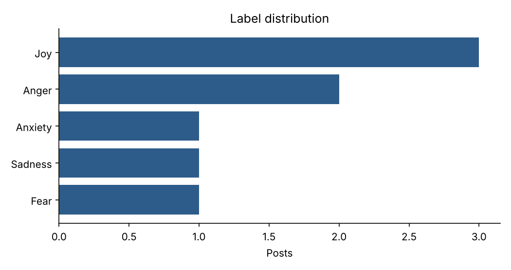

# kazemo

[](https://github.com/tenajuro12/kazemo/actions/workflows/ci.yml)
[](LICENSE)

Collection and pre-processing toolkit for **Kazakh and code-mixed Kazakh–Russian social-media text**.
It is the data layer of a master's thesis on automatically determining users' emotional state from
social-network messages with NLP.

```
Telegram ─┐
Threads  ─┼─► kazemo collect ─► raw.jsonl ─► kazemo process ─► clean.jsonl ─► annotation / LaBSE
YouTube  ─┘   (pseudonymised, deduplicated, language-filtered)    (+ stats, label chart)
```

## Features

**Collection** — one interface, three sources, all through official APIs:

| Source | Targets | API | Credentials |
|---|---|---|---|
| Telegram | public channels and groups, optional keyword filter | Telethon (client API) | `TELEGRAM_API_ID`, `TELEGRAM_API_HASH` |
| Threads | keyword search, or replies to a post | Threads API (graph.threads.net) | `THREADS_ACCESS_TOKEN` |
| YouTube | comments of given videos, or of videos found by a query | YouTube Data API v3 | `YOUTUBE_API_KEY` |

- **Privacy by design:** text is cleaned and pseudonymised *before* it is written; authors, usernames and
  platform user IDs are never stored. Each post gets a one-way `uid` hash used only for deduplication.
- **Resumable:** output is appended; re-running the same command skips posts already in the file.
- **Language filter:** `--lang kk` keeps only Kazakh (and code-mixed) posts.
- **Polite:** pagination with delays, automatic retry with back-off on HTTP 429/5xx.

**Pre-processing:**

| Step | Function | What it does |
|---|---|---|
| Normalise | `normalize` | Unicode NFC, whitespace collapsing |
| Clean | `clean` | links → `<URL>`, `#tag` → `tag`, `ааааа` → `ааа`, optional emoji removal |
| Pseudonymise | `pseudonymise` | `@user` → stable `@user_<hash>`, e-mails → `<EMAIL>`, phones → `<PHONE>` |
| Script ID | `detect_script` | `cyrillic` / `latin` / `mixed` / `none` |
| Language ID | `detect_language` | `kk` / `ru` / `unknown`, using Kazakh-specific letters (ә ғ қ ң ө ұ ү һ і) |
| Deduplicate | `deduplicate` | drops exact and near-exact duplicates (case and punctuation ignored) |
| Statistics | `stats`, `plot_labels` | language / script / source / label distribution, PNG chart |

## Installation

```bash
git clone https://github.com/tenajuro12/kazemo.git
cd kazemo
pip install -e ".[telegram,dev]"     # drop "telegram" if you only need Threads / YouTube
cp .env.example .env                 # then fill in the keys you need
```

Requires Python 3.10+.

### Getting credentials

- **Telegram:** log in at <https://my.telegram.org> → *API development tools* → create an app → copy
  `api_id` and `api_hash`. The first `kazemo collect telegram` run asks for your phone number and a code
  and saves a local `kazemo.session` file (git-ignored). For a server or CI run `kazemo login telegram`
  once and store the printed `TELEGRAM_SESSION` as a secret.
- **Threads:** create an app in Meta for Developers with the Threads API, generate a long-lived access
  token. Keyword search needs the `threads_keyword_search` permission.
- **YouTube:** Google Cloud Console → enable *YouTube Data API v3* → *Credentials* → API key.
  The free quota is 10,000 units/day (a comments page costs 1 unit, a search 100).

## Usage

### 1. Collect

```bash
# last 1000 posts from two public channels, Kazakh only
kazemo collect telegram some_kz_channel another_channel -o data/raw.jsonl --limit 1000 --lang kk

# only messages containing a word
kazemo collect telegram some_kz_channel --search "қорқамын" -o data/raw.jsonl

# Threads keyword search
kazemo collect threads "уайымдаймын" "қуаныштымын" -o data/raw.jsonl --limit 300

# YouTube: comments of specific videos, or of top videos for a query
kazemo collect youtube dQw4w9WgXcQ -o data/raw.jsonl
kazemo collect youtube "қазақша подкаст" --mode search -o data/raw.jsonl --lang kk ru
```

Each command prints a short report: `{"source": "telegram", "written": 812, "duplicates": 40, "filtered": 148}`.
One collected line looks like:

```json
{"uid": "3b1f0c9a7d2e4f11", "source": "telegram", "channel": "some_kz_channel", "date": "2026-10-01T09:12:00+00:00",
 "text": "Бүгін өте қуаныштымын!!! <URL>", "lang": "kk", "meta": {"views": 1520}}
```

### 2. Process and inspect

```bash
kazemo process data/raw.jsonl -o data/clean.jsonl --plot data/labels.png
kazemo stats data/raw.jsonl
```

`process` also accepts any JSONL with a `text` field (and optional `label`), e.g. `examples/sample.jsonl`.

### Python API

```python
from kazemo import clean, pseudonymise, detect_language
from kazemo.collect import YouTubeCollector, collect_to_jsonl

text = pseudonymise(clean("@aidos_kz Бүгін өте қуаныштымын!!!! https://t.me/x #той"))
# '@user_cc88a9b1 Бүгін өте қуаныштымын!!! <URL> той'
detect_language(text)  # 'kk'

report = collect_to_jsonl(YouTubeCollector(mode="search"), ["қазақша влог"], "data/raw.jsonl", limit=200, langs={"kk"})
```

Adding a new source means subclassing `kazemo.collect.Collector` and implementing `fetch(target, limit)`.



## Project structure

```
src/kazemo/
  preprocess.py        text functions
  pipeline.py          JSONL processing, statistics, chart
  collect/             base.py (Collector, Post, sink, HTTP), telegram.py, threads.py, youtube.py
  config.py            .env / environment secrets
  cli.py               kazemo collect | process | stats | login
tests/                 pytest; collectors are tested offline with fake API responses
examples/              synthetic posts for demos and CI
.github/               CI and release workflows, issue and PR templates
```

## Development

```bash
pytest            # tests + coverage report
ruff check .      # lint
ruff format .     # format
```

Tests never touch the network or need keys: API responses and the Telegram client are replaced by fakes.

## CI/CD

- **CI** (`.github/workflows/ci.yml`) — on every push and pull request to `main`:
  Ruff lint and format check → tests on Python 3.10–3.13 with a 90 % coverage gate →
  CLI smoke test → coverage report and sample outputs uploaded as build artifacts.
- **CD** (`.github/workflows/release.yml`) — on a `v*` tag: tests, builds the wheel and sdist,
  and publishes a GitHub Release with the packages attached.

```bash
git tag v0.2.0 && git push origin v0.2.0
```

## Data and ethics

- Collect only **public** content, through official APIs, within each platform's terms of service.
- Authors are never stored; mentions, e-mails and phone numbers are masked at collection time.
- Collected data stays local: `data/`, `.env` and session files are git-ignored. Do not publish raw corpora.
- The tool is for aggregate research on emotional language, not for monitoring or profiling individuals.

## License

MIT — see [LICENSE](LICENSE).
