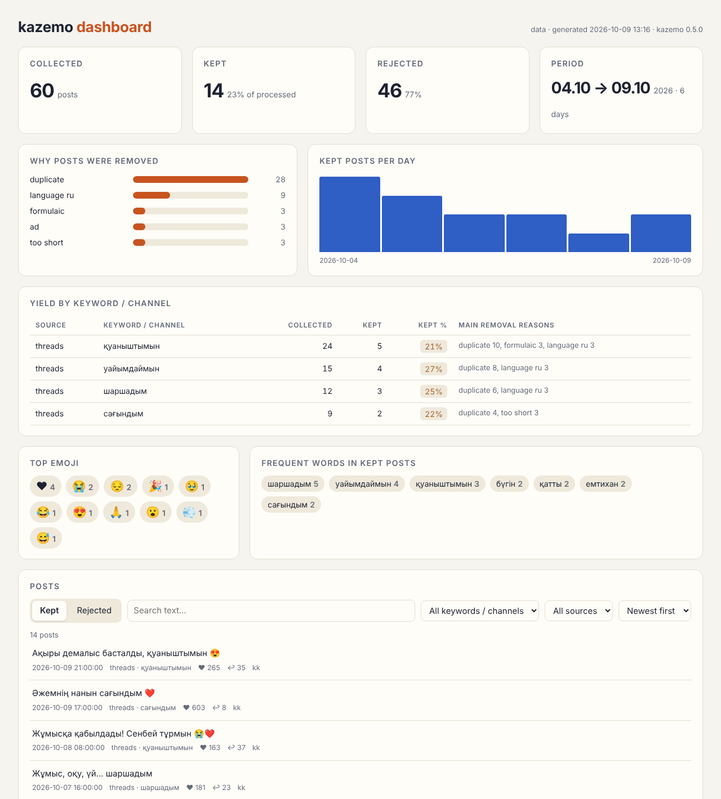

# kazemo

[](https://github.com/tenajuro12/kazemo/actions/workflows/ci.yml)
[](LICENSE)

Data pipeline for **emotion research on Kazakh and code-mixed Kazakh–Russian social media**: it collects
public posts, anonymises them, filters out noise and produces a clean corpus with a report and an offline
dashboard. It is the data layer of a master's thesis on automatically determining users' emotional state
from social-network messages with NLP.

```
  Telegram ──┐
  Threads ───┼─► 1. collect ──► raw.jsonl ──► 2. process ──► clean.jsonl ──► annotation / modelling
  YouTube ───┘   anonymise        (append-only)  filter, clean   rejected.jsonl (+ reason)
                 at collection                     deduplicate    report.json, dashboard.html
```

One command runs everything: `kazemo run pipeline.toml`.




---

## Contents

- [Quick start](#quick-start)
- [Credentials](#credentials)
- [The pipeline](#the-pipeline)
- [Configuration](#configuration-pipelinetoml)
- [Commands](#commands)
- [Dashboard](#dashboard)
- [Collection agent (optional)](#collection-agent-optional)
- [Output format](#output-format)
- [Data and ethics](#data-and-ethics)
- [Development, CI/CD](#development)

---

## Quick start

Python 3.10+.

```bash
git clone https://github.com/tenajuro12/kazemo.git
cd kazemo
python -m venv .venv
.venv\Scripts\Activate.ps1          # Windows PowerShell;  source .venv/bin/activate on Linux/macOS
pip install -e ".[dev]"             # add ,telegram and/or ,agent if you need them
copy .env.example .env              # cp on Linux/macOS — then fill in your keys
copy pipeline.example.toml pipeline.toml
kazemo run pipeline.toml
```

Results appear in `data/`; open `data/dashboard.html` in a browser (or `kazemo dashboard --open`).

> On Windows, if activating the environment is blocked, run once:
> `Set-ExecutionPolicy -Scope CurrentUser RemoteSigned`.
> When you download a new version, unpack it over the same folder so `.venv`, `.env` and `data/` stay.

## Credentials

Keys live in `.env` (git-ignored); see `.env.example`. You only need the ones for the sources you use.

| Source | Variables | Where to get them |
|---|---|---|
| Threads via Apify | `APIFY_TOKEN`, optionally `APIFY_THREADS_ACTOR`, `APIFY_THREADS_SESSION` | [console.apify.com](https://console.apify.com) → Settings → API & Integrations |
| Threads official API | `THREADS_ACCESS_TOKEN` | Meta for Developers → Threads API (public keyword search needs the approved `threads_keyword_search` permission) |
| Telegram | `TELEGRAM_API_ID`, `TELEGRAM_API_HASH` (`TELEGRAM_SESSION` for servers) | [my.telegram.org](https://my.telegram.org) → API development tools |
| YouTube | `YOUTUBE_API_KEY` | Google Cloud Console → YouTube Data API v3 |
| Collection agent | `ANTHROPIC_API_KEY` | [platform.claude.com](https://platform.claude.com) |

**Threads through Apify.** Two Apify actors are supported:

| Actor | Login | Price (approx.) | `.env` |
|---|---|---|---|
| `futurizerush/threads-search-scraper-api` ("Threads Search Scraper API") | needs a session key tied to a Threads account | ~$4 / 1000 posts | `APIFY_THREADS_ACTOR=futurizerush/threads-search-scraper-api` and `APIFY_THREADS_SESSION=...` |
| `aydar_cosmos/threads-scraper` (default) | none | ~$2 / 1000 posts | nothing extra |

The session key gives access to a Threads account: use a secondary account and never commit `.env`.
Apify runs sometimes fail with *"Threads was not responding"*; that is temporary on Threads' side —
re-run later, already collected posts are skipped.

## The pipeline

### 1. Collect

Each source is a collector with the same interface. Posts are written to `raw.jsonl` **already anonymised**:

- `@mentions` → stable pseudonyms `@user_<hash>`; links → `<URL>`; e-mails → `<EMAIL>`; phones → `<PHONE>`;
- authors, usernames and platform user IDs are never stored; each post gets a one-way `uid` hash for deduplication;
- hashtags, emoji and punctuation are left as posted for the next stage;
- re-running skips posts already in the file, so collection can be resumed or extended at any time;
- optional language filter at collection (`lang = ["kk"]`).

### 2. Process

| Step | What it does | Default |
|---|---|---|
| Ad filter | promo vocabulary (kk/ru/en), prices, contacts, 5+ hashtags; a post with ≥ 2 signals is an ad | on |
| Hashtag-only filter | posts that are mostly hashtags | on |
| Trailing hashtags | a block of 2+ hashtags at the end of a post is removed | on |
| Cleaning | `#tag` → `tag`, `ааааа` → `ааа`, whitespace | on |
| Emoji | `keep`, `remove`, or `text` (😭 → `:loudly_crying_face:`); the list is always saved in `emojis` | keep |
| Language | `kk` / `ru` / `unknown` from Kazakh-specific letters (ә ғ қ ң ө ұ ү һ і); keep only chosen languages | `kk` |
| Too short | fewer than `min_words` words (mentions, links, emoji not counted) | 3 |
| Courtesy formulas | short posts like "рахмет", "пайдалы болғанына қуаныштымын", "+" | on |
| Near-duplicates | same words ignoring case, punctuation, emoji, mentions and links | on |

**Why emoji, `!!!`, capitals and elongations are kept:** for emotion detection they are signal, not noise.
Elongations are shortened to three letters so intensity stays but the vocabulary does not explode.

Nothing is dropped silently: every removed post goes to `rejected.jsonl` with its `reason`, and the counts per
reason are in `report.json` and on the dashboard. The filters are simple rules on purpose — each removal can
be explained and checked.

### 3. Report and dashboard

`report.json` records what each source collected (or the error it hit), how many posts each filter removed,
and corpus statistics (sources, languages, scripts, emoji). `dashboard.html` shows all of it plus the posts.

## Configuration (`pipeline.toml`)

```toml
[output]
dir = "data"
dashboard = true

[collect]
limit = 100            # posts per keyword / channel
lang = ["kk"]

[[collect.source]]
name = "threads-apify"
targets = ["қуаныштымын", "уайымдаймын", "шаршадым", "қорқамын", "ашуым келді", "сағындым"]
mode = "recent"        # or "top"

# [[collect.source]]
# name = "telegram"
# targets = ["some_public_channel"]
# search = "қуаныш"

# [[collect.source]]
# name = "youtube"
# targets = ["қазақша подкаст"]
# mode = "search"

[process]
lang = ["kk"]
emoji = "keep"         # keep | remove | text
min_words = 3
filter_ads = true
ad_threshold = 2
filter_formulaic = true
strip_trailing_hashtags = true
deduplicate = true
```

The full commented example is `pipeline.example.toml`. A failing source (missing key, quota, platform error)
is recorded in the report and the other sources still run.

## Commands

| Command | Purpose |
|---|---|
| `kazemo run pipeline.toml` | collect → process → report → dashboard |
| `kazemo run pipeline.toml --skip-collect` | re-process what is already collected (free; use after changing filters) |
| `kazemo collect SOURCE TARGET... -o data/raw.jsonl` | collect from one source by hand (`--limit`, `--lang`, `--mode`, `--search`) |
| `kazemo process data/raw.jsonl -o data/clean.jsonl` | preprocessing only (`--lang`, `--emoji`, `--min-words`, `--keep-ads`, `--keep-formulaic`, `--keep-duplicates`) |
| `kazemo stats FILE` | corpus statistics for any JSONL file |
| `kazemo dashboard [DATA_DIR] [--open]` | rebuild the dashboard |
| `kazemo agent --goal "..." -o data/raw.jsonl` | LLM-planned collection (below) |
| `kazemo login telegram` | log in once and print a `TELEGRAM_SESSION` string for servers |

Sources: `threads-apify`, `threads` (official API: `--mode search|replies`), `telegram`, `youtube`
(`--mode video|search`).

## Dashboard

`data/dashboard.html` is a single self-contained file: no server, no internet, no external scripts — the data
never leaves the computer. It shows:

- totals, period, kept vs rejected;
- why posts were removed;
- **yield per keyword / channel** — collected, kept and kept % — to decide what to collect next;
- kept posts per day, top emoji, frequent words;
- a post browser with *Kept* / *Rejected* tabs, search with highlighting, filters by keyword, source and
  removal reason, sorting by date, likes and replies;
- errors from the last run.

## Collection agent (optional)

`kazemo agent` lets an LLM (Claude) plan the collection: it searches public Telegram channels, chooses Kazakh
keywords and queries, runs the collectors, compares how many Kazakh posts each target yields and drops weak
targets, until the budget is used.

```bash
pip install -e ".[telegram,agent]"
kazemo agent --goal "Kazakh posts expressing joy, sadness, fear, anxiety, anger, and neutral everyday posts" \
             --sources threads-apify telegram -o data/raw.jsonl --max-posts 300 --max-steps 15
```

The model only has four tools (`find_telegram_channels`, `collect`, `corpus_stats`, `finish`), never sees API
keys and never writes data itself; budgets (`--max-posts`, `--max-steps`, 500 posts per call) are enforced in
code; personal Telegram accounts are filtered out in code; every step is logged to `<output>.agent.jsonl`.
The agent only collects — it does not label anything. The same can run inside `kazemo run` via an `[agent]`
section in the config.

## Output format

`raw.jsonl` — one collected post per line:

```json
{"uid": "3b1f0c9a7d2e4f11", "source": "threads", "channel": "қуаныштымын", "date": "2026-10-09T07:24:45Z",
 "text": "Ақыры демалыс басталды, қуаныштымын 😍 #демалыс", "lang": "kk", "meta": {"likes": 12, "replies": 3, "via": "apify"}}
```

`clean.jsonl` — the same fields with cleaned `text` plus `script` (`cyrillic` / `latin` / `mixed`) and
`emojis`. `rejected.jsonl` — the original row plus `reason`.

## Data and ethics

- Only public content, through official APIs or a hosted scraping service; check each platform's terms and
  your ethics approval. Collection through Apify goes around the official Threads API and should be reported
  as such.
- Authors are never stored; mentions, links, e-mails and phone numbers are masked at collection time.
- Collected data stays local: `data/`, `.env` and session files are git-ignored. Do not publish raw corpora.
- The tool is for aggregate research on emotional language, not for monitoring or profiling individuals.

## Development

```bash
pytest            # tests + coverage
ruff check .      # lint
ruff format .     # format
```

Tests never touch the network or need keys: API responses, the Telegram client and the LLM are replaced by
fakes. The dashboard tests check that the page loads nothing from the internet and that post text cannot
break out of the embedded data.

```
src/kazemo/
  collect/         base.py (Collector, Post, sink, HTTP), telegram.py, threads.py, threads_apify.py, youtube.py
  preprocess.py    anonymisation, cleaning, emoji, language and script detection
  filters.py       ads, courtesy formulas, short and hashtag-only posts
  pipeline.py      the process stage, corpus statistics
  run.py           TOML-driven pipeline
  dashboard.py     dashboard data; dashboard.html is the page template
  agent.py         LLM collection agent
  config.py        .env / environment secrets
  cli.py           command-line interface
tests/             pytest, all offline
```

### CI/CD

- **CI** (`.github/workflows/ci.yml`) — on every push and pull request to `main`: Ruff lint and format check →
  tests on Python 3.10–3.13 with a 90 % coverage gate → CLI smoke test → coverage report and sample outputs
  uploaded as build artifacts.
- **CD** (`.github/workflows/release.yml`) — on a `v*` tag: tests, builds the wheel and sdist and publishes a
  GitHub Release.

```bash
git tag v0.5.0 && git push origin v0.5.0
```

## License

MIT — see [LICENSE](LICENSE).
